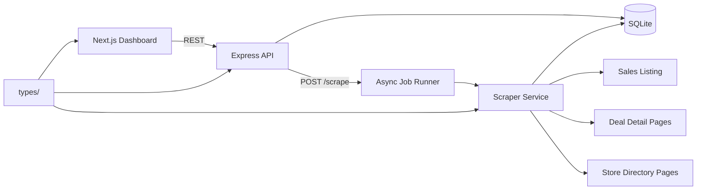

# Design Document — Promotions Aggregator (Single-Mall MVP)

**Status:** Pre-implementation  
**Source portal:** [The Promenade Shops at Briargate — Sales](https://www.thepromenadeshopsatbriargate.com/sales)  
**Target delivery:** End-of-day Sunday, 2026-06-21

---

## 1. Overview

This project is a vertical slice of a production promotions pipeline: scrape one mall portal, normalize and persist the data, expose it through a typed REST API, and render a browsable UI with filtering, pagination, and a group-by-brand view.

The stack is intentionally small and local-first:

| Layer | Choice | Rationale |
|---|---|---|
| Frontend | Next.js (App Router) + shadcn/ui | Typed React UI with accessible components; matches brief bonus stack |
| Backend | Express + TypeScript (MVC) | Separate API server; clear separation of scraping from presentation |
| Database | SQLite | Zero-config persistence; sufficient for single-portal MVP |
| Scraper | Axios + Cheerio | Axios handles redirects and real-world HTTP reliably; Cheerio parses server-rendered HTML |
| Shared types | Root `types/` folder | Single source of truth from scraper → API → UI |
| Runtime | Bun + local dev servers | `bun run dev` in `backend/` and `app/` |

**Authentication is intentionally omitted.** The take-home brief lists auth as a non-goal; the API is open on localhost.

---

## 2. Architecture



### Backend structure (MVC)

```
backend/src/
  routes/        Route definitions
  controllers/   Request/response handling
  services/      Scraper, promotions, brands, scrape jobs
  db/            SQLite connection, schema init, repositories
  middleware/    Error handling, validation, response helpers
```

### Frontend structure

```
app/
  app/dashboard/   Main UI: scrape controls, filters, table/cards, group-by-brand
  components/ui/   shadcn primitives only
  lib/             API client, query hooks
types/             Shared TypeScript contracts
```

---

## 3. Scraping Approach

### Why Axios + Cheerio

The source site is mildly picky about HTTP clients (redirects, headers). Axios provides redirect following, configurable timeouts, and stable request headers. Cheerio parses the server-rendered HTML without the overhead of a headless browser — appropriate for this portal where content is present in the initial HTML response.

### Three-phase scrape loop

**Phase 1 — Listing pass (no detail requests yet)**  
Fetch `/sales` and collect every `.deal-row` element. For each row, extract:

- Promotion name (`.deal-meta .major`)
- Brand name (`data-alpha` or `.deal-meta .minor` last child)
- Listing image (`img` src)
- Relative deal URL (`a[href]`)
- Store ID (`data-store-id`)
- Collection tag via `data-collection-id`:
  - `1013480` → `deals`
  - `1013483` → `style_notes`
  - `1013481` → `new_arrivals`
- Expiry hint from listing (e.g. `.notice--ends-today`, `.notice--ends-tomorrow`)
- Optional Excel serial dates from `data-start` / `data-end` as fallback

**Phase 2 — Detail pass (one request per promotion)**  
For each listing item, fetch the deal detail page (e.g. `/deals/3251680/`). Extract:

- Canonical title (`h1.head1`)
- Long description (`.deal-detail-description`)
- Detail image (`.image-deal`)
- Refined expiry text (`.notice` classes on detail page)
- Store link (`a.store-link[href]` → `/stores/{id}-{slug}/`)

**Phase 3 — Brand enrichment (deduplicated by store URL)**  
For each unique store URL, fetch the store directory page once. Extract:

- Display name (normalized for storage; symbols like `*` stripped)
- Description (`.store-description`)
- Hours (`.opening-hours` list items)
- Phone (`a[itemprop="phone"]`)
- External website (`a.external_link.ext_retailer`)
- Directory map URL (`a.read-more` in `.location-item`)
- Logo (`img.store-logo`)
- Social links where present on the page

### Politeness strategy

- **Rate limiting:** configurable delay (default ~500 ms) between sequential HTTP requests
- **User-Agent:** realistic browser UA string
- **Timeouts:** 15 s per request; failed requests are logged, not retried indefinitely
- **Concurrency:** sequential requests only (no parallel hammering of the portal)
- **Scope:** scrape only the sales listing, deal detail, and linked store pages — no crawling beyond the mall domain

### Date parsing

Expiry text is parsed relative to the scrape date (server local time, documented in ASSUMPTIONS.md):

| Source text | Parsed `endDate` |
|---|---|
| "Ends Today" | Today's date (ISO `YYYY-MM-DD`) |
| "Ends Tomorrow" | Tomorrow's date |
| Explicit date string | Parsed to ISO date |
| `data-end` Excel serial | Converted to ISO date as fallback |
| Unparseable / missing | `null` |

Start dates use `data-start` when available; otherwise `null`.

### Deduplication and re-scrape safety

Two stable business keys prevent duplicates across re-scrapes:

| Entity | `uniqueId` format | Example |
|---|---|---|
| Promotion | `{normalized_brand_name}_{deal_path_with_slashes_as_underscores}` | `bath_and_body_works_deals_3251680` |
| Brand | Store path slug from URL | `1036000_bath_and_body_works` |

Each entity also carries a UUID `id` for API references. On re-scrape, records are **upserted** on `uniqueId` — existing rows are updated in place; new promotions are inserted; stale promotions are left in place (soft retention) rather than hard-deleted, to avoid data loss if a listing temporarily disappears.

Brand name normalization for `uniqueId`: lowercase, strip special characters (`*`, `'`, etc.), replace spaces/hyphens with underscores.

---

## 4. Schema Design

### Normalized brands + promotions (not denormalized)

Brands and promotions are separate tables with a foreign key relationship.

**Why normalized:**
- Brand metadata (hours, website, socials) is fetched once per store and shared across many promotions
- Re-scraping a brand updates one row instead of N promotion rows
- `GET /brands` and group-by-brand UI are natural joins, not aggregation over duplicated blobs

**Trade-off:** API responses join brand data onto promotions at query time. This is acceptable for MVP scale (~hundreds of records) and keeps storage consistent.

### Tables

**`brands`**

| Column | Type | Notes |
|---|---|---|
| `id` | TEXT (UUID) | API primary key |
| `unique_id` | TEXT UNIQUE | Stable dedup key from store URL |
| `name` | TEXT | Display name |
| `website_url` | TEXT NULL | External retailer site |
| `hours` | TEXT (JSON) | Structured hours array |
| `social_links` | TEXT (JSON) | `{ platform, url }[]` |
| `phone` | TEXT NULL | |
| `location` | TEXT NULL | Address or location label if available |
| `directory_map_url` | TEXT NULL | Mall directory map link |
| `logo_url` | TEXT NULL | |
| `description` | TEXT NULL | Store description |
| `created_at` / `updated_at` | TEXT (ISO) | |

**`promotions`**

| Column | Type | Notes |
|---|---|---|
| `id` | TEXT (UUID) | API primary key |
| `unique_id` | TEXT UNIQUE | Stable dedup key |
| `brand_id` | TEXT FK → brands | |
| `name` | TEXT | Promotion title |
| `description` | TEXT NULL | From detail page |
| `image_url` | TEXT NULL | |
| `start_date` | TEXT NULL | ISO date |
| `end_date` | TEXT NULL | ISO date (expiry) |
| `tags` | TEXT (JSON) | `string[]`, at least one tag per record |
| `source_url` | TEXT | Canonical deal URL on mall site |
| `source_portal` | TEXT | Fixed portal identifier |
| `scraped_at` | TEXT (ISO) | Last successful scrape timestamp |
| `created_at` / `updated_at` | TEXT (ISO) | |

**`scrape_jobs`**

| Column | Type | Notes |
|---|---|---|
| `id` | TEXT (UUID) | Returned as `jobId` |
| `status` | TEXT | `pending` \| `running` \| `done` \| `failed` |
| `records_found` | INTEGER | Listing items discovered |
| `records_enriched` | INTEGER | Successfully persisted |
| `records_failed` | INTEGER | Failed detail/enrichment steps |
| `error` | TEXT NULL | Top-level failure message |
| `created_at` / `updated_at` | TEXT (ISO) | |

### Missing-data strategy

Applied consistently across scraper, DB, and API:

- **Scalar fields** (phone, website, dates, description): `null` when unavailable
- **Array fields** (tags, hours, social_links): `[]` when empty
- **Never silently drop records:** failed enrichments increment `records_failed` and are logged with the promotion URL and error reason

---

## 5. API Design

All endpoints are unauthenticated. Responses use a shared envelope defined in `types/response.ts`.

### Endpoints

| Method | Path | Description |
|---|---|---|
| `GET` | `/promotions` | Paginated list; query: `search`, `startDate`, `endDate`, `brand`, `page`, `pageSize` |
| `GET` | `/promotions/:id` | Single promotion with brand metadata |
| `GET` | `/brands` | All brands with `promotionCount` and metadata |
| `POST` | `/scrape` | Trigger async scrape; returns `202` + `{ jobId }` immediately |
| `GET` | `/scrape/:jobId` | Job status + summary when complete |

### Response envelopes

**Paginated success:**
```typescript
{
  success: true;
  message: string;
  data: T[];
  meta?: {
    pagination: {
      current_page: number;
      total_pages: number;
      total: number;
      per_page: number;
      from?: number;
      to?: number;
    };
  };
}
```

**Error:**
```typescript
{
  success: false;
  message: string;
  errors: string[];
}
```

Pagination is used only on list endpoints (`GET /promotions`). Single-resource and job-status responses omit `meta.pagination`.

Validation is handled with Zod at the controller/middleware layer. Invalid query params return `400` with the error envelope.

### Async scrape jobs

`POST /scrape` creates a job row with status `pending`, returns `202` immediately, and kicks off the scraper in a background promise (in-process, not a separate worker queue).

Job state transitions: `pending` → `running` → `done` | `failed`

Job records are persisted in SQLite so status survives API restarts within the same database file. For MVP, a single scrape runs at a time; concurrent `POST /scrape` requests either queue or reject with `409` (documented in ASSUMPTIONS.md).

---

## 6. Frontend Design

Single dashboard at `/dashboard` (root redirects here). No login/register pages.

**Features:**
- Trigger re-scrape button → `POST /scrape` → poll `GET /scrape/:jobId` until `done` or `failed`
- Skeleton loading states while data fetches
- Promotions table/cards with search, date range filter, brand filter, and shadcn pagination
- Toggle: flat list ↔ group-by-brand view (brand header shows website, hours, social links + nested promotions)
- External links to original deal URLs on the mall site

**Data fetching:** `@tanstack/react-query` for caching, polling scrape jobs, and invalidating promotion/brand queries after a successful scrape.

**UI components:** shadcn only (`Button`, `Input`, `Card`, `Table`, `Skeleton`, `Select`, `Pagination`, `Sonner`).

---

## 7. Shared Types

All cross-boundary types live in the root `types/` folder, one concept per file:

```
types/
  promotion.ts
  brand.ts
  scrape.ts
  response.ts
```

Both `backend/` and `app/` import from `types/` via TypeScript path aliases. Zod schemas co-located or derived where runtime validation is needed (query params, scrape output normalization).

---

## 8. Failure Modes and Mitigations

| Failure | Mitigation |
|---|---|
| HTTP request timeout or non-200 | Log URL + status; skip record; increment `records_failed`; job continues |
| Deal detail page missing store link | Persist promotion with listing-level data; brand fields remain `null` |
| Store page missing website/hours/socials | Upsert brand with available fields; rest stay `null` / `[]` |
| Unparseable expiry text | `endDate = null`; listing still stored |
| Site HTML structure change | Scraper throws parse errors per record; logged; partial data retained from listing pass |
| Scrape crash mid-run | Job marked `failed` with error message; previously upserted records remain valid |
| Concurrent scrape requests | Single-flight guard prevents overlapping scrapes |
| API process restart during scrape | In-flight background job is lost; job row may stay `running` — acceptable for MVP; manual re-trigger |

Scrape errors never crash the Express process. The global error middleware returns structured error responses.

---

## 9. What Was Cut (and Why)

| Cut | Reason |
|---|---|
| Authentication / JWT | Explicit non-goal in take-home brief |
| Multi-portal abstraction | Out of scope; single hard-coded portal |
| Headless browser (Playwright/Puppeteer) | HTML is server-rendered; Cheerio is sufficient and faster |
| Message queue / worker process | In-process async jobs meet the 202/poll contract at MVP scale |
| Hard-delete stale promotions on re-scrape | Risk of data loss; upsert-only is safer for a demo |
| Promotion detail page in UI | Bonus in brief; dashboard list + group view covers core stories |
| Automated test suite | Time-boxed; manual smoke test via README steps |
| Production deployment | Not containerized; run via `bun run build` + `bun run start` per service |

### With another 4 hours

1. Playwright fallback scraper for JS-rendered edge cases
2. Soft-expire flag on promotions missing from latest scrape
3. Integration tests against fixture HTML snapshots
4. Promotion detail drawer/modal in the UI
5. Persistent job queue (BullMQ or similar) for reliable background processing

---

## 10. Local development

Run each service independently with Bun:

```bash
cd backend && bun install && bun run dev   # http://localhost:3001
cd app && bun install && bun run dev       # http://localhost:3000
```

See `README.md` for build commands and env vars (`.env.example`).
