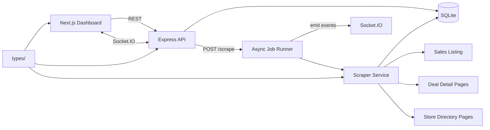

# Design Document — Promotions Aggregator (Single-Mall MVP)

**Status:** Implemented  
**Source portal:** [The Promenade Shops at Briargate — Sales](https://www.thepromenadeshopsatbriargate.com/sales)

---

## 1. Overview

This project is a vertical slice of a production promotions pipeline: scrape one mall portal, normalize and persist the data, expose it through a typed REST API with real-time scrape notifications, and render a browsable UI with filtering, sorting, pagination, and a group-by-brand view.

The stack is intentionally small and local-first:

| Layer | Choice | Rationale |
|---|---|---|
| Frontend | Next.js (App Router) + shadcn/ui | Typed React UI with accessible components; matches brief bonus stack |
| State | Zustand + React Query | Zustand for filter UI state; React Query for server cache and invalidation |
| Backend | Express + TypeScript (MVC) | Separate API server; clear separation of scraping from presentation |
| Real-time | Socket.IO | Push scrape lifecycle events to the dashboard without polling |
| Database | SQLite | Zero-config persistence; sufficient for single-portal MVP |
| Scraper | Axios + Cheerio | Axios handles redirects and real-world HTTP reliably; Cheerio parses server-rendered HTML |
| Shared types | Root `types/` folder | Single source of truth from scraper → API → UI |
| Runtime | Bun + local dev servers | `bun run dev` in `backend/` and `app/` |

**Authentication is intentionally omitted.** The take-home brief lists auth as a non-goal; the API is open on localhost.

---

## 2. Architecture



### Backend structure (MVC)

```
backend/src/
  routes/        Route definitions
  controllers/   Request/response handling
  services/      Scraper, promotions, brands
  db/            SQLite connection, schema init, repositories
  socket/        Socket.IO server and scrape event emitters
  middleware/    Error handling, validation, response helpers
```

### Frontend structure

```
app/
  app/dashboard/           Main route
  components/dashboard/    Header, filters, table, group view, tabs, skeletons
  components/ui/           shadcn primitives
  hooks/                   useDebounce, useDebouncedSearch, useDebouncedBrand
  lib/                     API client, scrape socket, sort/utils helpers
  stores/                  Zustand dashboard filter store
types/                     Shared TypeScript contracts
```

---

## 3. Scraping Approach

### Why Axios + Cheerio

The source site is mildly picky about HTTP clients (redirects, headers). Axios provides redirect following, configurable timeouts, and stable request headers. Cheerio parses the server-rendered HTML without the overhead of a headless browser — appropriate for this portal where content is present in the initial HTML response.

### Three-phase scrape loop

**Phase 1 — Listing pass (no detail requests yet)**  
Fetch `/sales` and collect every `.deal-row` element. For each row, extract:

- Promotion name (`.deal-meta .major`)
- Brand name (`data-alpha` or `.deal-meta .minor` last child)
- Listing image (`img` src)
- Relative deal URL (`a[href]`)
- Store ID (`data-store-id`)
- Collection tag via `data-collection-id`:
  - `1013480` → `deals`
  - `1013483` → `style_notes`
  - `1013481` → `new_arrivals`
- Expiry hint from listing (e.g. `.notice--ends-today`, `.notice--ends-tomorrow`)
- Optional Excel serial dates from `data-start` / `data-end` as fallback

**Phase 2 — Detail pass (one request per promotion)**  
For each listing item, fetch the deal detail page (e.g. `/deals/3251680/`). Extract:

- Canonical title (`h1.head1`)
- Long description (`.deal-detail-description`)
- Detail image (`.image-deal`)
- Refined expiry text (`.notice` classes on detail page)
- Store link (`a.store-link[href]` → `/stores/{id}-{slug}/`)

**Phase 3 — Brand enrichment (deduplicated by store URL)**  
For each unique store URL, fetch the store directory page once. Extract:

- Display name (normalized for storage; symbols like `*` stripped)
- Description (`.store-description`)
- Hours (`.opening-hours` list items)
- Phone (`a[itemprop="phone"]`)
- External website (`a.external_link.ext_retailer`)
- Directory map URL (`a.read-more` in `.location-item`)
- Logo (`img.store-logo`)
- Social links where present on the page

### Politeness strategy

- **Rate limiting:** configurable delay (default 500 ms via `SCRAPE_DELAY_MS`) between sequential HTTP requests
- **User-Agent:** realistic browser UA string
- **Timeouts:** 15 s per request (`REQUEST_TIMEOUT_MS`); failed requests are logged, not retried indefinitely
- **Concurrency:** sequential requests only (no parallel hammering of the portal)
- **Scope:** scrape only the sales listing, deal detail, and linked store pages — no crawling beyond the mall domain

### Date parsing

Expiry text is parsed relative to the scrape date (server local time, documented in ASSUMPTIONS.md):

| Source text | Parsed `endDate` |
|---|---|
| "Ends Today" | Today's date (ISO `YYYY-MM-DD`) |
| "Ends Tomorrow" | Tomorrow's date |
| Explicit date string | Parsed to ISO date |
| `data-end` Excel serial | Converted to ISO date as fallback |
| Unparseable / missing | `null` |

Start dates use `data-start` when available; otherwise `null`.

### Deduplication and scrape sessions

Each `POST /scrape` creates a new **scrape session** (auto-named `Scrape 1`, `Scrape 2`, …). Promotions are stored per session so runs can be compared side by side.

| Entity | Key | Notes |
|---|---|---|
| Promotion | `(uniqueId, scrapeSessionId)` | Same deal in different sessions is allowed |
| Brand | `uniqueId` from store URL | Shared across sessions; metadata upserted globally |

Promotion `uniqueId` format: `{normalized_brand_name}_{deal_path_with_slashes_as_underscores}`  
Brand `uniqueId` format: store path slug from URL (e.g. `1036000_bath_and_body_works`).

On re-scrape within a session, records are **upserted** — existing rows update in place; new promotions insert; stale promotions are left in place (soft retention) rather than hard-deleted.

Brand name normalization for `uniqueId`: lowercase, strip special characters (`*`, `'`, etc.), replace spaces/hyphens with underscores.

---

## 4. Schema Design

### Normalized brands + session-scoped promotions

Brands and promotions are separate tables. Promotions reference both a brand and a scrape session.

**Why normalized brands:**
- Brand metadata (hours, website, socials) is fetched once per store and shared across sessions
- Re-scraping a store updates one brand row instead of N promotion rows
- `GET /brands` and group-by-brand UI are natural joins

**Why session-scoped promotions:**
- Compare scrape runs without overwriting prior data
- Filter and paginate within a chosen snapshot

### Tables

**`brands`** — global store metadata (unchanged across sessions)

| Column | Type | Notes |
|---|---|---|
| `id` | TEXT (UUID) | API primary key |
| `unique_id` | TEXT UNIQUE | Stable dedup key from store URL |
| `name` | TEXT | Display name |
| `website_url` | TEXT NULL | External retailer site |
| `hours_json` | TEXT (JSON) | Structured hours array |
| `social_links_json` | TEXT (JSON) | `{ platform, url }[]` |
| `phone` | TEXT NULL | |
| `location` | TEXT NULL | |
| `directory_map_url` | TEXT NULL | |
| `logo_url` | TEXT NULL | |
| `description` | TEXT NULL | |
| `created_at` / `updated_at` | TEXT (ISO) | |

**`scrape_sessions`** — one row per scrape run

| Column | Type | Notes |
|---|---|---|
| `id` | TEXT (UUID) | API primary key |
| `name` | TEXT | Auto-generated (`Scrape N`) |
| `status` | TEXT | `pending` \| `running` \| `done` \| `failed` |
| `records_found` / `records_enriched` / `records_failed` | INTEGER | Running totals |
| `error` | TEXT NULL | Top-level failure message |
| `created_at` / `updated_at` | TEXT (ISO) | |

**`scrape_jobs`** — per-request job record (linked to session)

| Column | Type | Notes |
|---|---|---|
| `id` | TEXT (UUID) | Returned as `jobId` |
| `scrape_session_id` | TEXT FK | Parent session |
| `status` | TEXT | Same enum as session |
| `records_*` | INTEGER | Mirrors session counters for this job |
| `error` | TEXT NULL | |
| `created_at` / `updated_at` | TEXT (ISO) | |

**`promotions`** — session-scoped deal rows

| Column | Type | Notes |
|---|---|---|
| `id` | TEXT (UUID) | API primary key |
| `unique_id` | TEXT | Stable business key (with session) |
| `scrape_session_id` | TEXT FK | |
| `brand_id` | TEXT FK → brands | |
| `name` | TEXT | Promotion title |
| `description` | TEXT NULL | From detail page |
| `image_url` | TEXT NULL | |
| `start_date` / `end_date` | TEXT NULL | ISO dates |
| `tags_json` | TEXT (JSON) | `deals` \| `style_notes` \| `new_arrivals` |
| `source_url` | TEXT | Canonical deal URL |
| `source_portal` | TEXT | Fixed portal identifier |
| `scraped_at` | TEXT (ISO) | |
| `created_at` / `updated_at` | TEXT (ISO) | |
| UNIQUE | `(unique_id, scrape_session_id)` | |

Existing data from early development was migrated into **Scrape 1** when sessions were introduced.

### Missing-data strategy

- **Scalar fields** (phone, website, dates, description): `null` when unavailable
- **Array fields** (tags, hours, social_links): `[]` when empty
- **Never silently drop records:** failed enrichments increment `records_failed` and are logged with the promotion URL and error reason

---

## 5. API Design

All endpoints are unauthenticated. Responses use a shared envelope defined in `types/response.ts`.

### Endpoints

| Method | Path | Description |
|---|---|---|
| GET | `/health` | Health check |
| GET | `/promotions` | Paginated list; query: `search`, `startDate`, `endDate`, `brand`, `scrapeSessionId`, `order_by`, `page`, `pageSize` |
| GET | `/promotions/:id` | Single promotion with brand metadata |
| GET | `/brands` | Brands with `promotionCount`, metadata, and nested promotions; optional `scrapeSessionId` |
| GET | `/scrape-sessions` | All scrape sessions |
| GET | `/scrape-sessions/:id` | Single scrape session |
| POST | `/scrape` | Trigger async scrape; returns `202` + `{ jobId, scrapeSessionId, sessionName }` |
| GET | `/scrape/:jobId` | Job status + summary when complete |

### Sorting

`order_by` on `GET /promotions` (default `end_date`). Prefix `-` for descending.

Supported fields: `end_date`, `name`, `brand`, `tags`.

### Response envelopes

**Paginated success:**
```typescript
{
  success: true;
  message: string;
  data: T[];
  meta?: {
    pagination: {
      current_page: number;
      total_pages: number;
      total: number;
      per_page: number;
      from?: number;
      to?: number;
    };
  };
}
```

**Error:**
```typescript
{
  success: false;
  message: string;
  errors: string[];
}
```

Validation uses Zod at the controller layer. Invalid query params return `400` with the error envelope.

### Async scrape jobs and Socket.IO

`POST /scrape` creates a scrape session and job, returns `202` immediately, and runs the scraper in a background promise (in-process, not a separate worker queue).

Job state transitions: `pending` → `running` → `done` | `failed`

The dashboard connects via Socket.IO and listens for:

| Event | When |
|---|---|
| `scrape:active` | On connect — lists pending/running sessions |
| `scrape:started` | Job enters running state |
| `scrape:progress` | After listing parse and per-record updates |
| `scrape:completed` | Job finished successfully |
| `scrape:failed` | Job failed with error |

**Multiple concurrent scrapes are allowed.** Each request spawns an independent session. CORS for Socket.IO uses `FRONTEND_URL` (default `http://localhost:3000`).

HTTP request logging uses Morgan (`dev` in development, `combined` in production).

---

## 6. Frontend Design

Single dashboard at `/dashboard` (root redirects here). No login/register pages.

**Features:**
- **Run Scrape** — `POST /scrape`; Socket.IO toasts on start/complete/fail; React Query cache invalidation on completion
- **Scrape session selector** — filter list and group views by session; running sessions shown in dropdown
- **List view** — sortable table (end date, name, brand, tags); responsive column hiding; skeleton loading
- **Group-by-brand view** — tabs toggle; brand cards with website, hours, social links, nested promotions
- **Filters** — search, brand name, date range; 300 ms debounce on search and brand before API calls
- **Active filters summary** — chips with per-filter clear
- **Promotion detail dialog** — full fields + external deal link
- **Background scrapes banner** — visible while sessions are pending/running
- **Query error toasts** — React Query `meta.errorLabel` + centralized `QueryCache.onError`

**State:** Zustand store (`dashboard-filters.store.ts`) holds search, brand, date range, page, sort, view mode, and selected session. React Query handles server data.

**UI components:** shadcn (`Button`, `Input`, `Card`, `Table`, `Skeleton`, `Select`, `Pagination`, `Tabs`, `Dialog`, `Sonner`, date picker).

---

## 7. Shared Types

All cross-boundary types live in the root `types/` folder:

```
types/
  promotion.ts
  brand.ts
  scrape.ts
  scrapeSession.ts
  scrapeSocket.ts
  response.ts
```

Both `backend/` and `app/` import from `types/` via TypeScript path aliases. Zod schemas live in controllers for runtime validation of query params.

---

## 8. Failure Modes and Mitigations

| Failure | Mitigation |
|---|---|
| HTTP request timeout or non-200 | Log URL + status; skip record; increment `records_failed`; job continues |
| Deal detail page missing store link | Persist promotion with listing-level data; brand fields remain `null` |
| Store page missing website/hours/socials | Upsert brand with available fields; rest stay `null` / `[]` |
| Unparseable expiry text | `endDate = null`; listing still stored |
| Site HTML structure change | Scraper throws parse errors per record; logged; partial data retained from listing pass |
| Scrape crash mid-run | Session/job marked `failed`; Socket.IO `scrape:failed`; previously upserted records remain valid |
| API process restart during scrape | In-flight background job is lost; session row may stay `running` — acceptable for MVP; manual re-trigger |
| Socket disconnect | Client reconnects; receives `scrape:active` with current running sessions |

Scrape errors never crash the Express process. Global error middleware returns structured error responses.

---

## 9. What Was Cut (and Why)

| Cut | Reason |
|---|---|
| Authentication / JWT | Explicit non-goal in take-home brief |
| Multi-portal abstraction | Out of scope; single hard-coded portal |
| Headless browser (Playwright/Puppeteer) | HTML is server-rendered; Cheerio is sufficient and faster |
| Message queue / worker process | In-process async jobs meet the 202 + Socket.IO contract at MVP scale |
| Hard-delete stale promotions on re-scrape | Risk of data loss; upsert-only is safer for a demo |
| Single-scrape concurrency lock | Removed to allow comparing parallel runs; UI handles multiple active sessions |
| Automated test suite | Time-boxed; manual smoke test via README steps |
| Docker / production deployment | Local Bun dev only; build via `bun run build` per service |

### With another 4 hours

1. Playwright fallback scraper for JS-rendered edge cases
2. Soft-expire flag on promotions missing from latest scrape
3. Integration tests against fixture HTML snapshots
4. Server-side sort/filter for group-by-brand view
5. Persistent job queue (BullMQ or similar) for reliable background processing

---

## 10. Local development

### Environment variables

Copy the example files before first run (defaults match local dev):

```bash
cp backend/.env.example backend/.env
cp app/.env.example app/.env.local
```

| Service | Variable | Default | Purpose |
|---|---|---|---|
| Backend | `PORT` / `API_PORT` | `3001` | HTTP + Socket.IO port |
| Backend | `DATABASE_PATH` | `./data/promotions.db` | SQLite file |
| Backend | `SCRAPE_DELAY_MS` | `500` | Delay between scrape requests |
| Backend | `REQUEST_TIMEOUT_MS` | `15000` | HTTP timeout |
| Backend | `FRONTEND_URL` | `http://localhost:3000` | Socket.IO CORS origin |
| Backend | `NODE_ENV` | — | Morgan log format |
| Frontend | `NEXT_PUBLIC_API_URL` | `http://localhost:3001` | REST + Socket.IO base URL |

### Run

```bash
cd backend && bun install && bun run dev   # http://localhost:3001
cd app && bun install && bun run dev       # http://localhost:3000/dashboard
```

See [README.md](./README.md) for build commands, API examples, and scripts.
